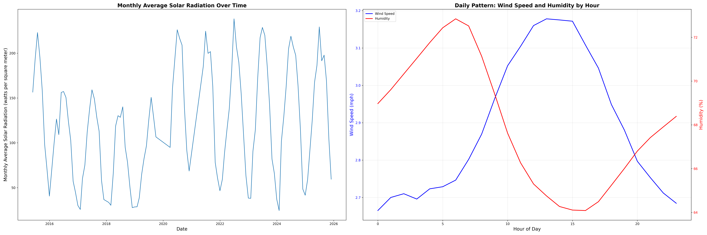
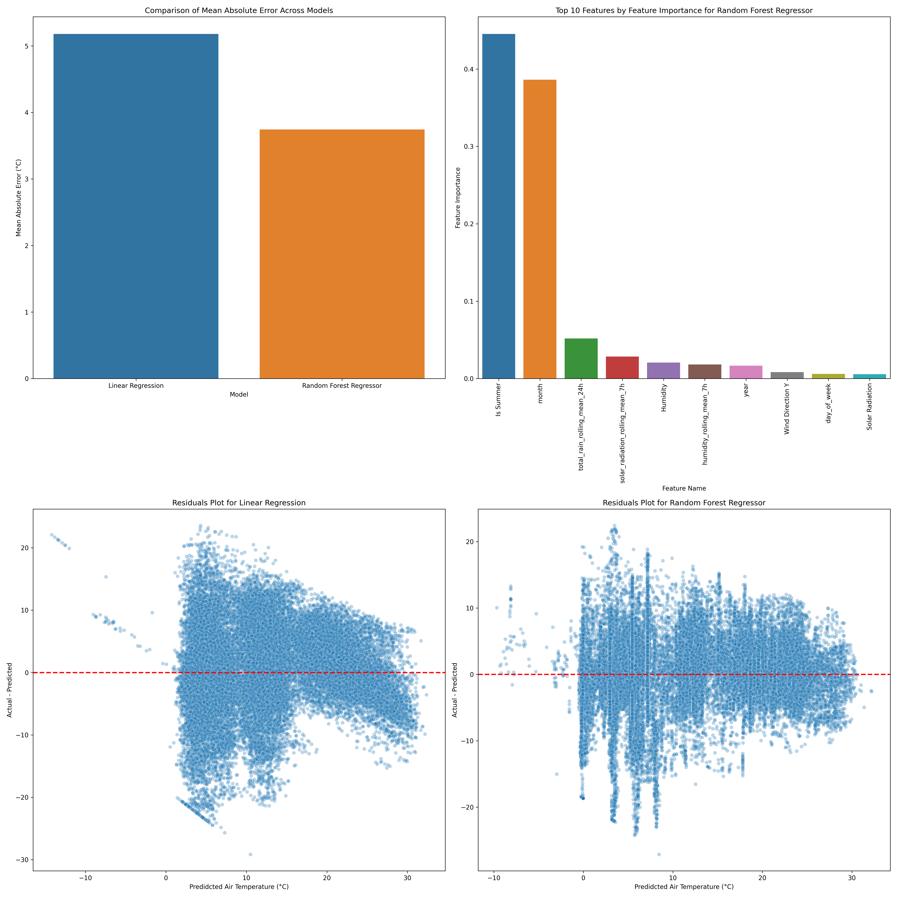
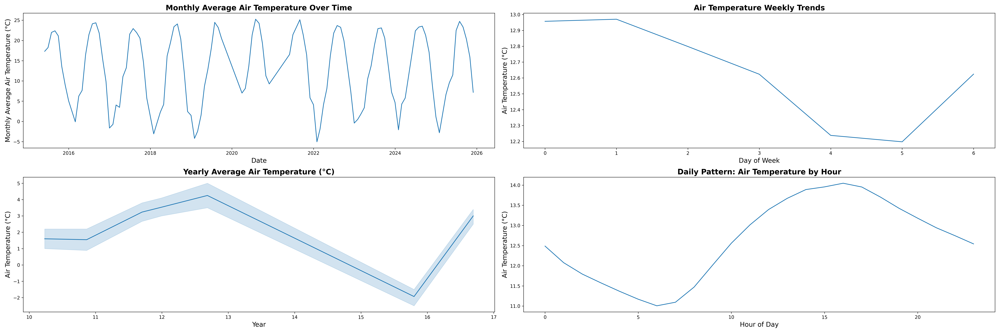

# Chicago Beach Weather Sensors Dataset Explorations

## Executive Summary

For this analysis, I investigate data from weather sensors from beaches in Chicago, Illinois, USA along the Lake Michigan lakefront. The weather sensor data contains 196,313 observations recorded hourly from three weather stations spanning April 25, 2015 to December 3, 2025.

The goal of the project was to follow the 9-phase data science workflow to examine temporal trends in weather in Chicago's beaches along Lake Michigan as well as apply machine learning models to the Chicago beach weather sensors data to generate predictions for Air Temperature (°C). 

The key finding of my work was that Random Forest Regressor emerged as the top-predicting model for Air Temperature (°C); however, since RMSE is fairly large, I would say that further work is needed to improve the Air Temperature predictions from the Chicago beach weather sensors data. 

## Phase-by-Phase Findings

### Phase 1-2: Exploration

After conducting some initial explorations of the Chicago beach weather sensors dataset, I found that the dataset contains 196,313 rows and 18 columns. The dataset contains features such as "Station Name", "Measurement Timestamp", "Air Temperature", "Wet Bulb Temperature", "Precipitation Type", "Wind Speed", and "Solar Radiation". "Station Name" corresponds to the name of the weather sensor station that measured a given data entry and "Measurement Timestamp" indicates the time (specific to the hour) at which a given data entry was recorded. The data was measured from April 25, 2015 at 9 AM to December 3, 2025 at 10 AM. 

All of the features of the dataset save for "Station Name", "Measurement Timestamp", "Measurement Timestamp Label", and "Measurement ID" are numeric. Below is a table providing more detailed information about the type of each feature of the data:

| Column Name                  | Data Type         |
|------------------------------|-------------------|
| Station Name                 | object            |
| Measurement Timestamp        | object            |
| Air Temperature              | float64           |
| Wet Bulb Temperature         | float64           |
| Humidity                     | int64             |
| Rain Intensity               | float64           |
| Interval Rain                | float64           |
| Total Rain                   | float64           |
| Precipitation Type           | float64           |
| Wind Direction               | int64             |
| Wind Speed                   | float64           |
| Maximum Wind Speed           | float64           |
| Barometric Pressure          | float64           |
| Solar Radiation              | int64             |
| Heading                      | float64           |
| Battery Life                 | float64           |
| Measurement Timestamp Label  | object            |
| Measurement ID               | object            |

Below is a table displaying some summary statistics of the numeric features of the dataset: 

| column_name          | mean                   | std                      | min       | max     | missing_count |
|----------------------|------------------------|---------------------------|-----------|---------|----------------|
| Air Temperature      | 12.624225073635074     | 10.435491250453873        | -29.78    | 37.6    | 75             |
| Wet Bulb Temperature | 10.27482096273034      | 9.403981662014425         | -28.9     | 28.4    | 75947          |
| Humidity             | 68.02391588942149      | 15.633995713561301        | 0.0       | 100.0   | 0              |
| Rain Intensity       | 0.15892693950118802    | 1.794022816610356         | 0.0       | 183.6   | 75947          |
| Interval Rain        | 0.14236790227850427    | 1.0969230607538099        | -0.9      | 63.42   | 0              |
| Total Rain           | 141.48457122443216     | 190.4590771816808         | 0.0       | 1056.1  | 75947          |
| Precipitation Type   | 4.267774953059834      | 15.589548562681943        | 0.0       | 70.0    | 75947          |
| Wind Direction       | 140.80295752191654     | 122.00747357163634        | 0.0       | 359.0   | 0              |
| Wind Speed           | 2.918785307137072      | 5.341879881583158         | 0.0       | 999.9   | 0              |
| Maximum Wind Speed   | 3.556968208931655      | 5.955099747225225         | 0.0       | 999.9   | 0              |
| Barometric Pressure  | 994.3134273348728      | 10.02922023732468         | 0.0       | 3098.5  | 146            |
| Solar Radiation      | 112.34736874277301     | 842.8080702318339         | -100000.0 | 1277.0  | 0              |
| Heading              | 281.9668344881445      | 142.7717524102073         | 0.0       | 359.0   | 75947          |
| Battery Life         | 13.163250014008243     | 1.5446151630769804        | 0.0       | 15.3    | 0              |

I generated some initial visualizations of the distribution of Air Temperature (°C) and Wet Bulb Temperature (°C) over time. Below are the visualizations:

*Figure 1: Initial generated visualizations investigating the variables Air Temperature and Wet Bulb Temperature. The plot on the left displays the distribution of Air Temperature (°C) in the Chicago beach weather sensors dataset and the plot on the right displays a time series plot of Wet Bulb Temperature (°C).*

From these visualizations, one can see that Air Temperature ranges from around -30 °C to around 38 °C, with two peaks that occur at around 2-4 °C and 20-24 °C. One can also observe that Wet Bulb Temperature follows seasonal patterns. 

**Key Data Quality Issues:**
I identified some important data quality issues in the dataset. The dataset contains 7 columns with missing data: Air Temperature, Wet Bulb Temperature, Rain Intensity, Total Rain, Precipitation Type, Barometric Pressure, and Heading. Here is a more detailed breakdown of the number of missing values per column: 

| Column Name                  | Number of Missing Values   | 
|------------------------------|----------------------------|
| Air Temperature              | 75                         | 
| Wet Bulb Temperature         | 75947                      | 
| Rain Intensity               | 75947                      | 
| Total Rain                   | 75947                      | 
| Precipitation Type           | 75947                      | 
| Barometric Pressure          | 146                        | 
| Heading                      | 75947                      |

I defined an outlier as a value having a z-score with a magnitude greater than 3. I found that columns of Air Temperature, Wet Bulb Temperature, Humidity, Rain Intensity, Interval Rain, Total Rain, Precipitation Type, Wind Speed, Maximum Wind Speed, Barometric Pressure, Solar Radiation, and Battery Life contain outliers. Here is a more detailed breakdown of the columns with outliers and the corresponding number of outliers the column has:

| Column                | Count |
|-----------------------|-------|
| Air Temperature       | 296   |
| Wet Bulb Temperature  | 487   |
| Humidity              | 134   |
| Rain Intensity        | 1434  |
| Interval Rain         | 2298  |
| Total Rain            | 4023  |
| Precipitation Type    | 12657 |
| Wind Speed            | 27    |
| Maximum Wind Speed    | 20    |
| Barometric Pressure   | 87    |
| Solar Radiation       | 13    |
| Battery Life          | 6     |

I also noticed that there were some hours between the start time of the dataset of April 25, 2015 at 9 AM to the end time of the dataset of December 3, 2025 at 10 AM where data wasn't recorded. 

### Phase 3: Data Cleaning

I performed data cleaning on the Chicago beach weather sensors dataset to handle missing data and outliers, validate data types, and remove duplicates so that the data is in a more reliable format for future analysis that I will be conducting. 

An interesting observation is that all of the columns that contained missing values and all of the columns that contained outliers were numeric columns. I decided to impute missing values using forward-fill in order to better maintain overall trends that our time series data contains. I defined an outlier as a datapoint with z-score with a magnitude greater than 3, and capped outliers to have at most a z-score with a magnitude of 3. By imputing missing values and capping outliers, we are able to retain our previous dataset size and can ensure that the dataset doesn't lose a significant amount of entries before we carry out later steps in the data science workflow. 

**Cleaning Results:**
- Number of rows before cleaning: 196,313
- Missing Data Handling: all missing values were imputed using forward-fill 
  - Air Temperature: 75 missing values handled
  - Wet Bulb Temperature: 75947 missing values handled
  - Rain Intensity: 75947 missing values handled
  - Total Rain: 75947 missing values handled
  - Precipitation Type: 75947 missing values handled 
  - Barometric Pressure: 146 missing values handled
  - Heading: 75947 missing values handled
- Outlier Handling: capped outliers to have at most a z-score of magnitude 3 (3 standard deviations from the mean)
  - Air Temperature: 296 outliers handled
  - Wet Bulb Temperature: 487 outliers handled
  - Humidity: 134 outliers handled 
  - Rain Intensity: 1434 outliers handled 
  - Interval Rain: 2298 outliers handled 
  - Total Rain: 4023 outliers handled 
  - Precipitation Type: 12657 outliers handled 
  - Wind Speed: 27 outliers handled 
  - Maximum Wind Speed: 20 outliers handled 
  - Barometric Pressure: 87 outliers handled 
  - Solar Radiation: 13 outliers handled 
  - Battery Life: 6 outliers handled
- Number of duplicate rows removed: 0
- Data Type Conversions:
  - 'Measurement Timestamp' converted to datetime64[ns] format
- Number of rows after cleaning: 196313

The data cleaning I applied on the dataset was able to keep the dataset size the same as before while also addressing data quality issues. 

### Phase 4: Data Wrangling

I parsed the "Measurement Timestamp" column from its original ‘MM/DD/YYYY HH:MM:SS AM/PM’ string format and converted it into a datetime object. I then set the "Measurement Timestamp" column as the index of the DataFrame so that I can conduct more time series operations on the data. I also derived additional temporal features from Measurement Timestamp to support further temporal analysis. Here is a more detailed breakdown of the new temporal features I created: 

- `hour`: hour of the day using 24-hour time (0 corresponds to midnight and 23:00 corresponds to 11 PM)
- `day_of_week`: day of the week (0 = Monday, 1 = Tuesday, 2 = Wednesday, 3 = Thursday, 4 = Friday, 5 = Saturday, 6 = Sunday)
- `month`: month of the year (represented in number form, for example 1 = January)
- `year`: year
- `day_name`: name of the day (e.g. Monday)
- `is_weekend`: binary indicator of whether it is weekend or not (1 if weekend, 0 if weekday)

### Phase 5: Feature Engineering

I applied feature engineering on the dataset to extract additional variables in order to transform the original variables in the data into more informative variables so that machine learning models applied on the data can better capture the data's underlying patterns. I also decided to create rolling window features to better represent time-based interactions in the data. Here is a more detailed breakdown of the additional features I created: 

- Wind Speed Squared: values in Wind Speed column squared 
- Is Raining: binary indicator of whether it is raining or not (1 if raining, 0 if not raining)
- Is Summer: binary indicator of whether data was recorded during summer or not (1 if it is summer, 0 if it is not summer)
- Is Winter: binary indicator of whether data was recorded during winter or not (1 if it is winter, 0 if it is not winter)
- Is Spring: binary indicator of whether data was recorded during spring or not (1 if it is spring, 0 if it is not spring)
- Is Fall: binary indicator of whether data was recorded during fall or not (1 if it is fall, 0 if it is not fall)
- Maximum Wind Speed - Wind Speed: difference between the maximum wind speed recorded during the hour in mph and the average wind speed recorded during the hour in mph 
- Wind Direction X: x-coordinate of wind direction, calculated by $$\text{Wind Direction X} = \text{Wind Speed}  \cdot \cos\left(\text{Wind Direction} \cdot \frac{\pi}{180}\right)$$

- Wind Direction Y: y-coordinate of wind direction, calculated by $$\text{Wind Direction Y} = \text{Wind Speed}  \cdot \sin\left(\text{Wind Direction} \cdot \frac{\pi}{180}\right)$$
- Rain Intensity x Humidity: captures the interaction between rain intensity and humidity, calculated by multiplying values in Rain Intensity column by corresponding value in the same row in Humidity column
- Sin_Hour: sine transform of hour in day in order to encode hour of day into a cyclical value, calculated by $$\text{Sin Hour} =  \sin\left(2 \pi \cdot \frac{\text{hour}}{24} \right)$$

- Cos_Hour: cosine transform of hour in day in order to encode hour of day into a cyclical value, calculated by $$\text{Cos Hour} =  \cos\left(2 \pi \cdot \frac{\text{hour}}{24} \right)$$

**Rolling Window Features:**

- barometric_pressure_rolling_mean_7h: 7 hour rolling mean of Barometric Pressure
- humidity_rolling_mean_7h: 7 hour rolling mean of Humidity
- solar_radiation_rolling_mean_7h: 7 hour rolling mean of Solar Radiation
- total_rain_rolling_mean_24h: 24 hour rolling mean of Total Rain

Note: I did not extract any new features from "Air Temperature", as that is the variable I am trying to predict with my analysis. Feeding new features extracted from "Air Temperature" into the machine learning models would cause data leakage, as I would be essentially informing the machine learning models of the results during training. 

### Phase 6: Pattern Analysis

I then applied further pattern analysis and advanced visualizations to the data.

Here are some interesting visualizations that I generated: 

*Figure 2: More advanced pattern analysis of the variables Solar Radiation and Wind Speed. The plot on the left displays monthly trends in Solar Radiation (watts per square meter) and the plot on the right displays daily patterns in Wind Speed (mph) and Humidity (%) by hour of day.*

**Temporal Trends**:
- Monthly average solar radiation shows seasonal patterns
- Higher solar radiation in summer months (June to August)
- Lower solar radiation in winter months (December to February)
- Monthly solar radiation range: 24.5 to 238.3 watts per square meter

**Daily Patterns:**
 - Wind speed tends to be higher from around 9 AM to 6 PM
 - Wind speed achieves peak at around 1 PM
 - Minimum wind speed occurs at midnight
 - Humidity tends to be higher from midnight to 9 AM
 - Humidity achieves peak at around 6 AM
 - Minimum humidity occurs at around 4 PM

**Correlations:**
- Air Temp vs Wet Bulb Temp: 0.83 (strong positive correlation)
- Air Temp vs Is Summer: 0.62 (moderate positive correlation)

### Phase 7: Modeling Preparation

The next step was to prepare the dataset to be fed into the machine learning models later. I selected which features to feed into the machine learning models and the target variable. Then, I performed a temporal train/test split on the data. 

I made "Air Temperature" the target variable with the goal of investigating whether other measured conditions at the Chicago beaches can be used to predict "Air Temperature" or not. 

**Feature Selection:**

I excluded 'Station Name' from being a predictor because I felt that which beach weather sensor station recorded the data should not affect the temperature significantly. I excluded 'Measurement ID' and 'Measurement Timestamp Label' because they were metadata variables that described more information about the Measurement Timestamp column. I removed 'day_name' because it conveys essentially the same information as 'day_of_week'. I also removed 'Wet Bulb Temperature' because it is a very similar measurement to 'Air Temperature', and I wanted to prevent data leakage.

From the remaining features, I calculated their correlations with the target variable "Air Temperature", and selected the features with the top 20 highest correlations to be used for the future modeling phase. This was done to ensure that only features with high predictive power are fed into the machine learning models while minimizing model complexity to reduce overfitting. 

Features chosen: 'Is Summer', 'total_rain_rolling_mean_24h', 'Total Rain', 'solar_radiation_rolling_mean_7h', 'month', 'Solar Radiation', 'Is Fall', 'Wind Direction Y', 'hour', 'humidity_rolling_mean_7h', 'Heading', 'Interval Rain', 'Humidity', 'Maximum Wind Speed - Wind Speed', 'year', 'Rain Intensity x Humidity', 'Rain Intensity', 'is_weekend', 'day_of_week', 'Cos_Hour'

The dataset was of dimensions 196313 rows × 20 columns before temporal train/test split

**Temporal Train/Test Split:**
- Split Method: Temporal (80/20 split by time)
- Training Set Size: 157049
- Training Date Range: 2015-04-25 09:00:00 to 2023-07-05 22:00:00
- Test Set Size: 39264
- Test Date Range: 2023-07-05 23:00:00 to 2025-12-03 10:00:00

The reason why I use a temporal train/test split is to prevent datapoints in the future from being in the training data, as that would cause data leakage. 

### Phase 8: Modeling

I applied two models: Linear Regression and Random Forest Regressor on the data. Below is a table comparing the performance of the two models across the training set and test set using error metrics of R², RMSE, and MAE: 

**Model Performance:**

| Model                   | Metric       | Train           | Test           |
|-------------------------|-------------|----------------|----------------|
| Linear Regression       | R²          | 0.60498        | 0.56953        |
|                         | RMSE        | 6.59300        | 6.64386        |
|                         | MAE         | 4.97993        | 5.17897        |
| Random Forest Regressor | R²          | 0.88826        | 0.73672        |
|                         | RMSE        | 3.50659        | 5.19591        |
|                         | MAE         | 2.57324        | 3.74353        |

Below are the features in the Random Forest Regressor model ranked by feature importance 

**Feature Importance (Random Forest Regressor):**
Top features by importance:
1. Is Summer (0.4453 importance)
2. month (0.3862 importance)
3. total_rain_rolling_mean_24h (0.0518 importance)
4. solar_radiation_rolling_mean_7h (0.0284 importance)
5. Humidity (0.0206 importance)
6. humidity_rolling_mean_7h (0.0181 importance)
7. year (0.0167 importance)
8. Wind Direction Y (0.0083 importance)
9. day_of_week (0.006 importance)
10. Solar Radiation (0.0056 importance)
11. Total Rain (0.0035 importance)
12. hour (0.0034 importance)
13. Is Fall (0.0025 importance)
14. Heading (0.0014 importance)
15. Maximum Wind Speed - Wind Speed (0.0013 importance)
16. is_weekend (0.0004 importance)
17. Cos_Hour (0.0002 importance)
18. Rain Intensity x Humidity (0.0001 importance)
19. Interval Rain (0.0001 importance)
20. Rain Intensity (0.0 importance)

We notice that the variables "Is Summer" and "month" together account for 83.15% of the total feature importance. This indicates that Air Temperature follows strong seasonal patterns. Three of the top five most important variables were extracted from the original features of the dataset through feature engineering. Together, the top three features account for 88.33% of total feature importance. 

### Phase 9: Results

*Figure 3: Final visualizations of my explorations with the Chicago beach weather sensors dataset. The plot on the top left is a barplot comparing the test set MAE for Linear Regression and Random Forest Regressor. The plot on the top right is a barplot comparing the importance values for the top 10 most important features for the Random Forest Regressor model. The bottom two plots are residuals plots for both models.*

From the residuals plots, we can see that the residuals for both models are fairly evenly and randomly spread. However, for both models, there are some points at the left end that aren't near the other points on the plot. Furthermore, both plots take on a "funnel shape", with the bottom of the funnel pointing to the right. This means that both plots exhibit heteroscedasticity. It is important to note that the residuals plot for Random Forest Regressor is stronger than the Linear Regression residuals plot.

**Key Findings:**

- The best performing model is Random Forest Regressor (R² Score = 0.73672, RMSE = 5.19591, MAE = 3.74353)
- The top two most important features are "Is Summer" and "month", which are temporal features
- Rolling window variables also have high importance
- Air Temperature follows strong seasonal patterns
- Air Temperature also follows daily and weekly cycles
- Feature engineering is essential for generating strong predictions of Air Temperature using information recorded by Chicago beach weather sensors
- Data cleaning was applied to the dataset to help to ensure data is reliable while also preserving original size of data

### 3. Visualizations (at least 5 figures with captions)

*Figure 1: Initial generated visualizations investigating the variables Air Temperature and Wet Bulb Temperature. The plot on the left displays the distribution of Air Temperature (°C) in the Chicago beach weather sensors dataset and the plot on the right displays a time series plot of Wet Bulb Temperature (°C).*

*Figure 2: More advanced pattern analysis of the variables Solar Radiation and Wind Speed. The plot on the left displays monthly trends in Solar Radiation (watts per square meter) and the plot on the right displays daily patterns in Wind Speed (mph) and Humidity (%) by hour of day.*

*Figure 3: Final visualizations of my explorations with the Chicago beach weather sensors dataset. The plot on the top left is a barplot comparing the test set MAE for Linear Regression and Random Forest Regressor. The plot on the top right is a barplot comparing the importance values for the top 10 most important features for the Random Forest Regressor model. The bottom two plots are residuals plots for both models.*

*Figure 4: Additional visualizations generated to explore seasonal, weekly, daily, and overall patterns in Air Temperature. The plot on the top left displays monthly trends in Air Temperature (°C) over time. The plot on the top right displays weekly trends in Air Temperature (°C). The plot on the bottom left displays yearly trends on Air Temperature over time. The plot on the bottom right displays daily patterns in Air Temperature (°C).*

### 4. Model Results

Below is a table comparing the performance of Linear Regression and Random Forest Regressor across the training set and test set using error metrics of R², RMSE, and MAE: 

**Model Performance:**

| Model                   | Metric       | Train           | Test         |
|-------------------------|-------------|----------------|----------------|
| Linear Regression       | R²          | 0.60498        | 0.56953        |
|                         | RMSE        | 6.59300        | 6.64386        |
|                         | MAE         | 4.97993        | 5.17897        |
| Random Forest Regressor | R²          | 0.88826        | 0.73672        |
|                         | RMSE        | 3.50659        | 5.19591        |
|                         | MAE         | 2.57324        | 3.74353        |

**Error Metrics Interpretation:**
- **R² Score:** The R² Score indicates how much of the variation in the dependent variable (in our case, our dependent variable is Air Temperature) can be explained by the model. The R² Score ranges from 0% to 100%.
- **RMSE (Root Mean Squared Error):** RMSE is a measure of the average magnitude of the differences between the predictions made by a model and the actual values. RMSE is able to maintain the original units of the outcome variable. In our case, RMSE tells us typically how many degrees Celsius we expect the predicted values to be "off" the actual values by.
- **MAE (Mean Absolute Error):** MAE is the absolute value of the average differences between the predictions made by a model and the actual values. MAE is able to maintain the original units of the outcome variable. In our case, MAE tells us typically how many degrees Celsius we expect the predicted values to be "off" the actual values by.

**Model Selection:** 
- The best performing model is Random Forest Regressor (R² Score = 0.736717, RMSE = 5.19591, MAE = 3.743533)
- This is because Random Forest Regressor outperforms Linear Regression for all three error metrics—Random Forest Regressor achieves R² Score closer to 1, smaller RMSE, and smaller MAE

**Feature Importance Insights:**
- The most important feature is "Is Summer", which alone accounts for 44.53% of all feature importance
- The top two most important features are temporal features of "Is Summer" and "month"
 - These two features alone account for 83.15% of all feature importance
- Seven of the top ten most important variables are temporal variables (e.g. month, year)
- This indicates that temporal variables have more predictive power than weather variables and that air temperature demonstrates strong seasonal cycles
- Three of the top ten variables are rolling windows of predictor variables, indicating that rolling window variables are also important for Air Temperature prediction
- Top three features account for 88.33% of total importance
- The top ten most predictive features also include variables that represent or are derived from total rain, solar radiation, humidity, and wind direction
- Eight of top ten most important features were derived from the original features in dataset through feature engineering, meaning that feature engineering is essential to developing machine learning models that accurately predict Air Temperature

### 5. Time Series Patterns

The analysis I conducted on the Chicago beach weather sensors dataset reveals several important temporal patterns: 

**Long-term Trends:**
- Air Temperature remains fairly stable over the course of the Chicago beach weather sensors data which spans approximately 10 years and 7 months
- Air Temperature follows repeating seasonal patterns every year
 - Although there may be some colder or warmer years, Air Temperature does not exhibit any noticeable overall decreasing or increasing trends over the course of the data

**Seasonal Patterns:**
- Daily: Air Temperature follows a pattern that repeats every 24 hours
 - Air Temperature reaches its daily minimum at 6 AM and reaches its daily maximum at 5 PM
- Weekly: Air Temperature starts out higher at Day 0 (Monday) during the start of the week and reaches its peak on Tuesday
 - Air Temperature then decreases until it reaches its minimum on Saturday
 - Afterward, Air Temperature rises again
- Monthly: Air Temperature follows seasonal patterns
 - Air Temperature is highest during summer months (June, July, August) and is lowest during winter months (December, January, February)

 **Temporal Relationships**:
- Air Temperature variable follows seasonal patterns
 - "Is Summer" and "month" are the top two most important variables
- Air Temperature for Chicago's beaches is affected by weather conditions in Chicago's beaches in the previous hours and previous day
 - Seven hour rolling window features of weather conditions have high feature importance
- Air Temperature follows daily and weekly cycles
 - "hour" and "day_of_week" have fairly high feature importance
- Air Temperature exhibits some fluctuation from year-to-year

**Anomalies:**
- Variables of Wet Bulb Temperature, Rain Intensity, Total Rain, Precipitation Type, and Heading have quite a few missing values, with 75,947 missing values each
- Variable Precipitation Type has 12,657 outlier values
- There are some hours between the start time and end time of the data where no data is recorded
 - It is likely that sensors weren't recording data during these times

### 6. Limitations & Next Steps

**Data Quality Issues**
- 379956 missing values were addressed with a blanket method of imputing using Forward Fill
 - Given that this was a significant number of missing values, imputing large amounts of data points could negatively influence model results
- My method of classifying outliers resulted in 21482 data points being classified as outliers
 - Quite a few data points were classified as being outliers, which seems implausible given the context of working with Chicago beach weather sensor data
 - I chose to cap these outlier values, which may have overadjusted the data and edited datapoints that weren't problematic 
- For certain hours between the start time of the data at 2015-04-25 09:00:00 and the end time of the data 2025-12-03 10:00:00, the sensors did not record data
 - These gaps make it harder to identify overall time series trends in the data 
- Only three beach weather sensors recorded data, limiting the spatial coverage of the data 

**Model Limitations**
- Residuals plots for both Linear Regression and Random Forest Regressor aren't fully randomly distributed and show heteroscedasticity, indicating that Linear Regression and Random Forest Regressor may not be the strongest models for predicting Air Temperature from Chicago beach weather sensors data
- Top-performing model of Random Forest Regressor shows some overfitting
 - From training set to test set, R² Score for Random Forest Regressor decreases by 0.15154 RMSE increases by 1.68932, and MAE increases by 1.17029
 - Random Forest Regressor's performance decreases pretty significantly from training to test set 
- Top-performing model of Random Forest Regressor achieves an RMSE of 5.19591 °C, which is fairly large given that Air Temperature ranges from around -30 °C to 38 °C
- Air Temperature predictions were generated based solely from data recorded at beaches along Chicago's Lake Michigan front, which means that results may not generalize well to other geographic locations 

**Additional Features That Could Be Created:**
- Additional temporal features (e.g. a feature corresponding to whether it is afternoon or not)
- Additional rolling window features that cover a larger variety of window sizes
- Lag features that use value at previous timestamp in data as input for model at current timestamp to better capture temporal dependencies in data

**Additional Analysis That Would Be Valuable**:
- Compare performance of models against a baseline so that it can be better assessed whether a given model's results are reliable or not
- Include more error metrics when evaluating performance of models to better assess performance of each model
- Conduct more thorough investigations of when models are making errors and when errors are more pronounced
 - For example, I would care more that a model is predicting Air Temperature more accurately during the daytime, as I am more likely to rely on Air Temperature predictions during the day, rather than at nighttime when I am sleeping
- Conduct further analysis on missing values in the Chicago beach weather sensors data and possible patterns in missing values

**How Results Could be Validated or Extended**
- Apply temporal cross-validation to data to better evaluate how well the machine learning models trained on the Chicago beach weather sensors data generalize to unseen data 
- Validate models using weather sensors datasets from other regions to assess how well the machine learning models trained on the Chicago beach weather sensors data generalize to beach weather sensors data from other regions
- A future avenue to pursue is to incorporate the machine learning models into existing weather forecasting systems so that hourly Air Temperature forecasts at Chicago beaches can be provided for Chicago residents and tourists 
- Another future direction is to develop a continuously-updating pipeline that automatically pulls data from Chicago beach weather stations and retrains models on data in real time, ensuring that predictions are made using the most recent data 

### Conclusion

I successfully applied the 9-phase data science workflow to the Chicago beach weather sensors data. This analysis found that Air Temperature in Chicago's beaches follows seasonal, weekly, and daily cycles. The top-performing Random Forest Regressor model was able to achieve an R² score of 0.73672, RMSE of 5.19591, and MAE of 3.74353 on the test set. Random Forest Regressor outperformed Linear Regression, demonstrating that ensemble learning has superior predictive power over linear models. This exploration also demonstrated that feature engineering is essential for generating strong Air Temperature predictions from Chicago beach weather sensors data. The findings of this analysis can help inform future predictions made based from weather information recorded at beaches. 

